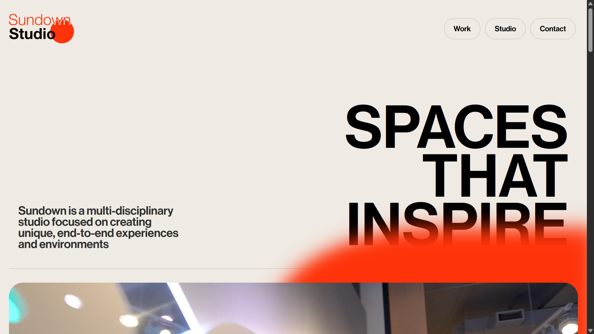
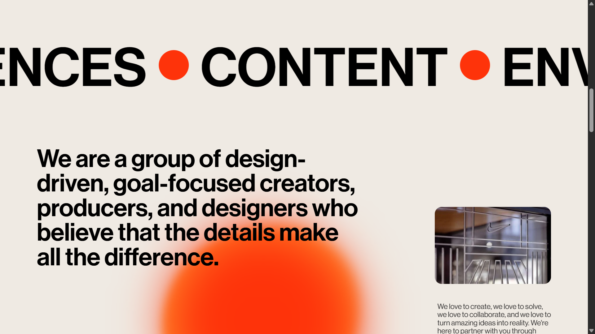
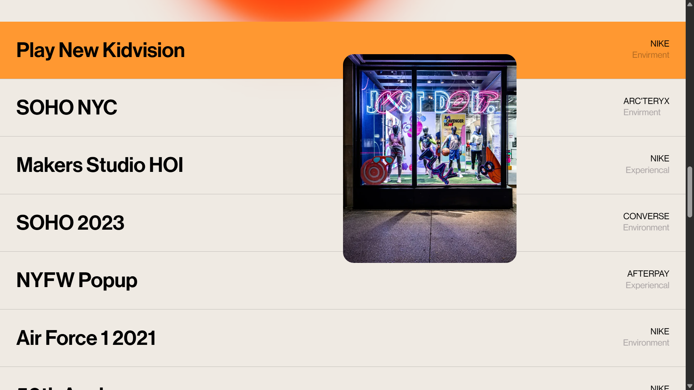
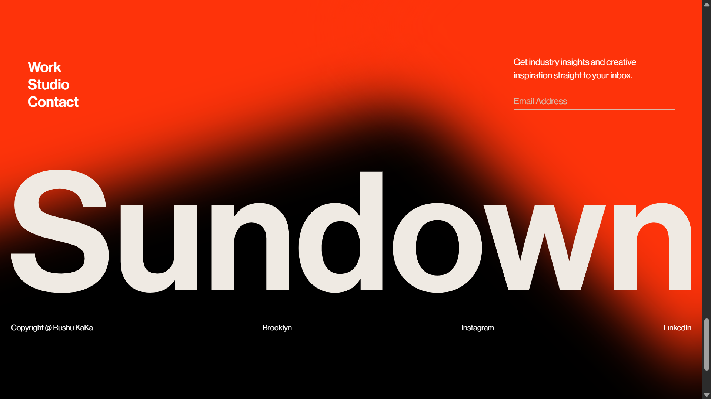

# 🌐 Sundown Studio Inspired Website

A modern, visually engaging website inspired by Sundown Studio, built with a strong focus on **high-quality UI/UX, smooth animations, and interactive design**.

This project demonstrates my ability to create **professional, responsive, and production-ready websites** tailored for real-world clients and businesses.

---

## 🚀 Key Highlights

* ✨ Smooth animations and modern UI effects
* 🎯 Interactive hover experiences and dynamic visuals
* 📱 Fully responsive design (mobile, tablet, desktop)
* ⚡ Clean, optimized, and scalable frontend code
* 🎨 Pixel-perfect design implementation

---

## 🛠️ Tech Stack

* HTML5
* CSS3 (Animations, Flexbox, Responsive Design)
* JavaScript (DOM Manipulation, Interactivity)
* Bootstrap

---

## 📸 Project Preview






---

## 🌐 Live Demo

👉 https://your-live-link.com

---

## 💼 What You Get

* A modern and visually appealing website
* Smooth and engaging user experience
* Responsive design that works on all devices
* Clean and maintainable code for long-term use
* A professional online presence for your business

---

## 💼 My Services

* Custom website development
* Landing pages and business websites
* UI/UX focused frontend design
* Website redesign and improvements
* Converting designs (Figma/PSD) into live websites

---

## 🎯 Why Work With Me

* Strong attention to detail in design and development
* Clean and professional coding practices
* Focus on performance and user experience
* Reliable communication and on-time delivery
* Dedicated to delivering high-quality results

---

## 📂 Project Structure

```
index.html  
css/  
js/  
images/  
```

---

## 👨‍💻 About Me

**Rushikesh**
Frontend Developer

I specialize in building modern, responsive, and interactive websites that help businesses create a strong online presence.

---

## 📬 Contact Me

* GitHub: http://github.com/RushuKaka
* Email: [rushikeshvadher@gmail.com](mailto:your-email@example.com)

---

⭐ If you like this project, feel free to give it a star!
